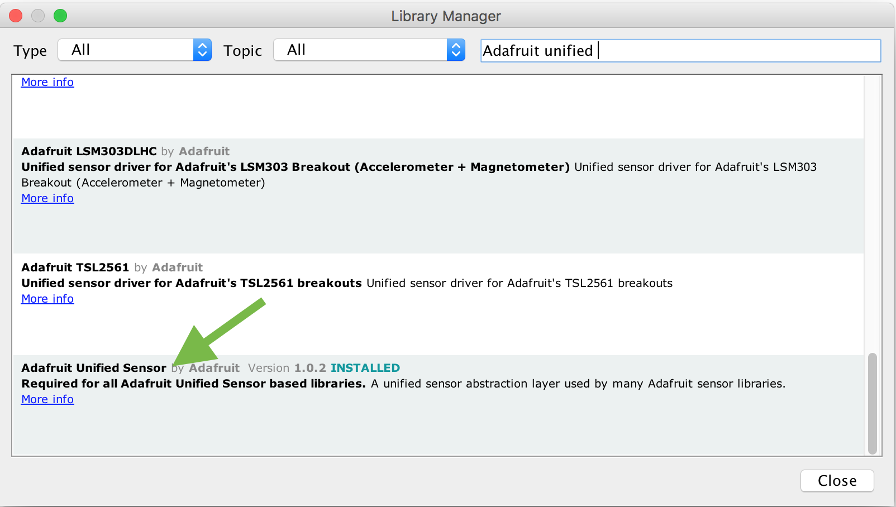

# Prepare your development Environment

1. [Get started with LinkIt One and Arduino IDE](https://docs.labs.mediatek.com/resource/linkit-one/en/getting-started/get-started-on-os-x/get-the-hardware-and-software-for-mac-os-x)
2. [Install LinkIt One SDK in the Board Manager of Arduino IDE](https://docs.labs.mediatek.com/resource/linkit-one/en/getting-started/get-started-on-os-x/install-the-arduino-ide-and-linkit-one-sdk-on-os-x)
3. The following driver support is required, so please download these library and place them at the same folder as your *.ino sketch. 

	* [Adafruit BMP085 Unified](https://github.com/adafruit/Adafruit_BMP085_Unified)
	* [Adafruit Sensor](https://github.com/adafruit/Adafruit_Sensor)
	* [Grove LCD RGB Backlight](https://github.com/Seeed-Studio/Grove_LCD_RGB_Backlight)
	* [HttpClient](https://github.com/amcewen/HttpClient/releases)

	You can include these libraries in 2 different ways:
	
	1. Install them directly from library manager in the Arduino IDE.
		
		
		
		```
		#include <Adafruit_Sensor.h>
		#include <Adafruit_BMP085_U.h>
		#include <rgb_lcd.h>
		```
	
	2. download the libraries and place them at the same directory as your *.ino sketch (Just like what we do in this example).
	
		```
		#include "Adafruit_Sensor/Adafruit_Sensor.h" 
   		#include "Adafruit_BMP085_Unified/Adafruit_BMP085_U.h"
   		#include "Grove_LCD_RGB_Backlight/rgb_lcd.h"
		```	

4. Before you download this Arduino sketch into your LinkIt One, you have to configure the Wi-Fi and some variables (MCS device ID and key) which will be used in the Arduino sketch. 

	* [How to configure Wi-Fi](https://docs.labs.mediatek.com/resource/linkit-one/en/tutorials/weather-station-tutorial#WeatherStationtutorial-configWiFi) and you can modify the **wifi.txt** attached in this repository.
	* Fill in the device ID and device key of your MCS device into **device.txt** file.

5. Upload the *.ino into your LinkIt One and have fun.


# WeatherStation tutorial 
You can refer to the official tutorial for more comprehensive information. 
[MediaTek Labs: Weather Station tutorial](https://docs.labs.mediatek.com/resource/linkit-one/en/tutorials/weather-station-tutorial)


